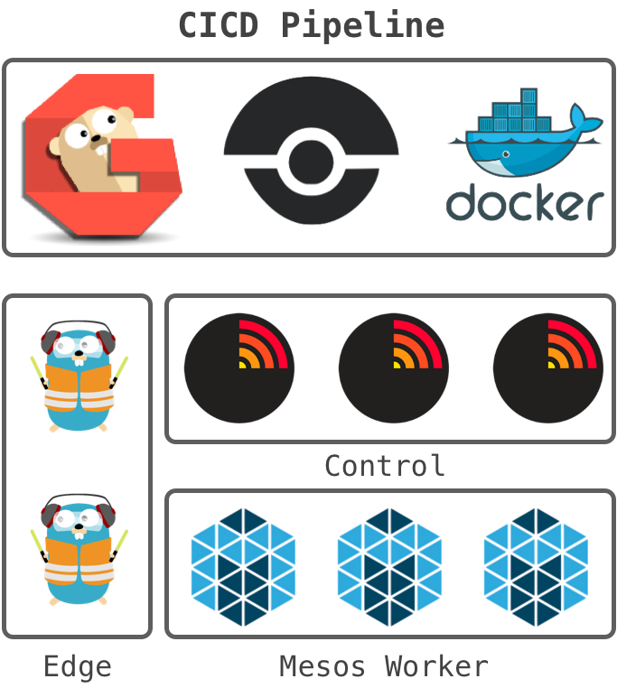
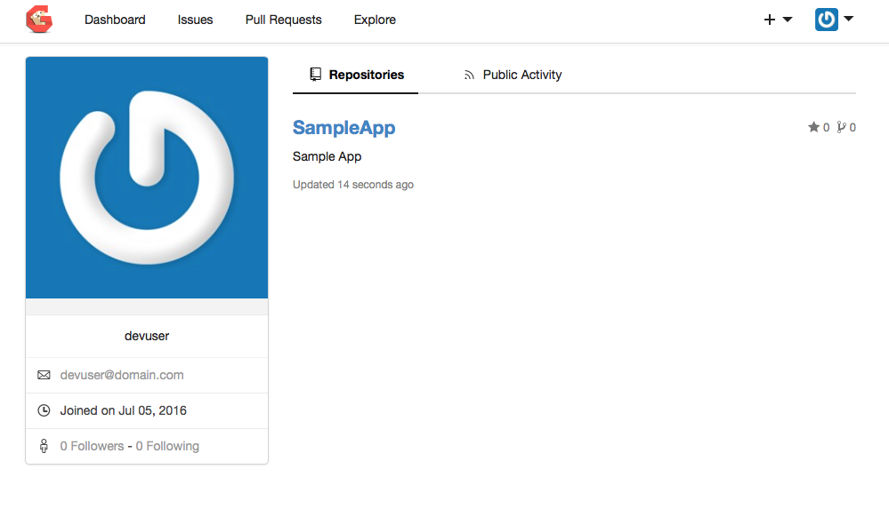
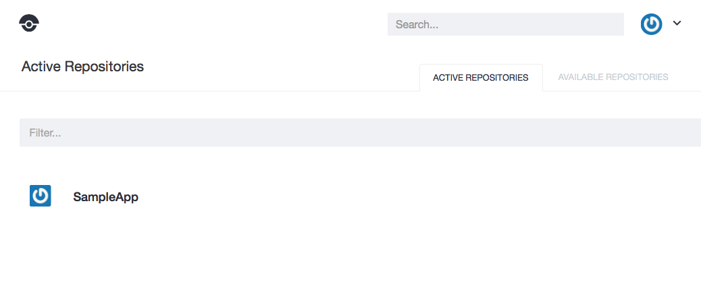

# Mantl CICD



This is a project to make it easy to add a basic development tools onto a [Mantl.io](https://github.com/CiscoCloud/mantl) deployment.

## Current Status:

* Deploy the following components as applications running within Marathon on the Mantl Cluster
    * Version Control Server
      * Currently using [Gogs.io](http://gogs.io)
    * CICD Build Server
      * Currently using [Drone.io](http://drone.io)
    * Docker Container Registry
      * Currently using [Registry](https://hub.docker.com/_/registry/)
* Automate the integration between the VCS and Build Servers

## Planned additions

* Deploy a sample application into the environment where
  * The code is stored in the VCS Server
  * A build job is configured to integrate and act on changes to the repo
  * Artifacts are stored in the container registry
  * A dev and prod instance of the application are deployed onto the Mantl cluster

# Setup and Installation

## Prerequisites

**The installation scripts should work on any Mac or Linux Server.  Providing Windows install scripts is a future goal**

Before beginning, you will need to have a Mantl cluster deployed and fully operational.  This cluster can be deployed onto any supported cloud, however it will need to be able to access the internet to download the containers for the pipeline components.

You will need the following details about your Mantl Environment to deploy:

* FQDN or IP for a Mantl Control Node
* Admin Username and Password for Mantl
* The Traefik domain where deployed applications are available
* A Deployment Name for the installation.  This needs to be unique in your environment
  * _Each applicaiton will be deployed within Marathon under this name_
* A path on the Mesos Worker nodes where container volumes can be created
  * Though not required to install, it is suggested this path be a shared mount on ALL worker nodes
  * Using an NFS mount is one easy way to accomplish this
    * Included in this repo is [nfs-setup.yml](nfs-setup.yml), an Ansible Playbook that can be used to add an NFS mount to all worker nodes
    * You will need to update the following VARS in the playbook for your NFS environment
      * nfsserver
      * nfspath
* You will also be asked to provide details for Development Tools Admin and End User

## Setup

Once you have all the information needed, simply run this command from a terminal to enter the details.

```
# From the Repo Director
source setup

```

You will run through the following dialog.

```
****************************************************
Please provide basic details on your Mantl install.

What is the address of your Control Servers?
eg: control.mantl.internet.com
control.mantl.domain.com

What is the username for your Mantl account?
admin


What is the password for your Mantl account?


What is the Traefik domain for your deployed apps?
mantl.domain.com


What path on the Workers should container Volumes be created at?
  Leave off the trailing slash.  Example '/mount/mantl-data'
  This is required to maintain state between container restarts.
  It is suggested to provide a shared path across all Worker Nodes.
  Example: An NFS Mounted Directory.

 ** FORMATING NOTE:  **
    Because this data is later used to update the template files,
    you must double escape the '/' in the paths.
    so this is the correct input for the example path:
    \\/mount\\/mantl-data

\\/mount\\/mantl-data


Deployment name would you like to use for the CICD Apps?
    For example, if you enter 'cicd' you will access GitLab at http://cicd-gitlab.mantl.domain.com
devtools

Marathon API calls will be sent to:
https://control.mantl.domain.com:8080/

****************************************************
Please provide the following information on your Development Tools Users.

Admin Username for Development Tools?
  Username of admin is NOT allowed
devadmin

Admin Password for Development Tools?
  * Input hidden

Admin Email for Development Tools?
devadmin@domain.com

Username for Development Tools End User?
  Usernames of admin or devadmin are NOT allowed
devuser

Password for Development End User?
  * Input hidden

Email for Development End User?
devuser@domain.com

****************************************************
Once deployed, applications will be available at:
    Gogs:              http://devtools-gogs.mantl.domain.com
    Docker Registry:   http://devtools-registry.mantl.domain.com
    Drone:             http://devtools-drone.mantl.domain.com

```

## Install

Now run the installation script with this command

```
# From the Repo director
./install.sh

```

The installation should take between 3 and 10 minutes depending on the speed of your cluster.  Here is an example output for reference.

```
***************************************************
Checking if Gogs has already been deployed
    Not already installed, continuing.
Creating Application Definition Files

***************************************************
Deploying Gogs
  % Total    % Received % Xferd  Average Speed   Time    Time     Time  Current
                                 Dload  Upload   Total   Spent    Left  Speed
100  2166    0  1217  100   949   1832   1429 --:--:-- --:--:-- --:--:--  1832
***************************************************


***************************************************
Deploying Registry
  % Total    % Received % Xferd  Average Speed   Time    Time     Time  Current
                                 Dload  Upload   Total   Spent    Left  Speed
100  2026    0  1154  100   872   1784   1348 --:--:-- --:--:-- --:--:--  1786
***************************************************

Checking if Gogs is up
Gogs not up yet, checking again in 30 seconds.
Gogs not up yet, checking again in 30 seconds.
Gogs not up yet, checking again in 30 seconds.

Gogs is up.  Beginning Configuraiton

Gogs has been configured successfully.

Moving onto create new Gogs Users.

Development End User added to Gogs successfully.

Moving onto deploy Drone.

***************************************************
Deploying Drone
  % Total    % Received % Xferd  Average Speed   Time    Time     Time  Current
                                 Dload  Upload   Total   Spent    Left  Speed
100  2521    0  1372  100  1149   2105   1763 --:--:-- --:--:-- --:--:--  2107
***************************************************

Checking if Drone is up
Drone not up yet, checking again in 30 seconds.
Drone not up yet, checking again in 30 seconds.
Drone not up yet, checking again in 30 seconds.

Drone is up.  Beginning Configuraiton

***************************************************
Registrying Development Admin User with Drone.
  % Total    % Received % Xferd  Average Speed   Time    Time     Time  Current
                                 Dload  Upload   Total   Spent    Left  Speed
100    35    0     0  100    35      0     61 --:--:-- --:--:-- --:--:--    61

Drone admin configured

***************************************************
Installation completed successfully.

You can acess the apps at:
    Gogs:              http://devtools-gogs.mantl.domain.com
    Drone:             http://devtools-drone.mantl.domain.com
    Docker Registry:   http://devtools-registry.mantl.domain.com
       * Docker Registry lacks a Web UI, use docker commands to interact

You can log into Gogs and Drone as either your admin user or end user accounts.
As a reminder:  Admin User - devadmin
                End User   - devuser

If you need their passwords you can use the following commands to retrieve them.

  These commands will only work until you close the terminal session, then the passwords are lost.
    echo $GOGS_APP_ADMIN_PASSWORD
    echo $GOGS_APP_USER_PASSWORD


```

# Usage

Once the installation completes, you can access the tools at the URLs that were provided at completion.

* Gogs is a full featured VCS that leverages git syntax and commands.  More details can be found at http://gogs.io.
* For informaiton on using Drone, see http://readme.drone.io
* Docker Registry is deployed without any authentication or security.  You'll need to configure your client to support this setup.
  * **_ToDo - Add docs and details here_**

Here are some screenshots showing the main interfaces.

**Gogs Interface**



**Drone Interface**



